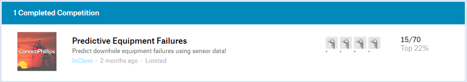

# My first data science hackathon

# Introduction
#### Can we predict failures that occur both on the surface and below the ground? 
This was the problem we tried solving for ConocoPhillips as a part of the TAMU Datathon in October 2019. The result from this prediction can be used to send crews out to a well location to fix equipment on the surface or send a workover rig to the well to pull down-hole equipment and address the failure

# Data Overview
The data set contained failure events that occurred on surface equipment and down-hole equipment and for each failure event, data has been gathered from over 107 sensors that collect a variety of physical information both on the surface and below the ground. It had 60K records for training our model and 16K records to evaluating its performance

Kaggle competition link: https://www.kaggle.com/c/equipfailstest

# Approach
•	Since it was an anonymized data, we used Iterative imputer and some complex rules that we formulated to impute the missing values 
•	Random Forest, XGBoost and Light GBM were used for prediction 
•	XGBoost and LightGBM were used without imputing the nulls as well 
•	30 mins of H2O’s Auto ML was also leveraged

# Result
At the end of 24hrs, we finished 15th among the 70 teams that participated in the competition

