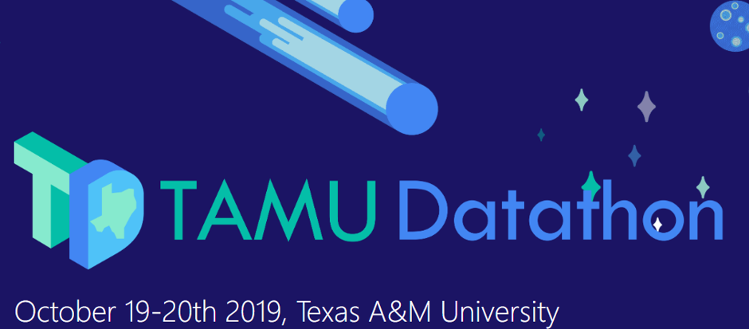

# My first data science hackathon

Our team took up the problem of predicting the equipment failures for ConocoPhillips from the multitude of challenges available and at the end of 24hrs, we finished 15th among the 70 participants. This repository contains the code that we used for this competition

